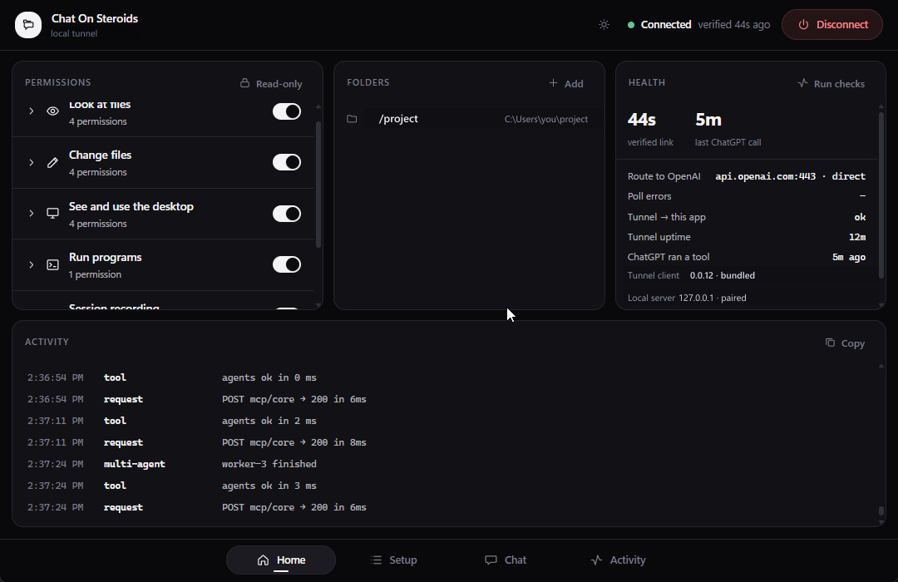
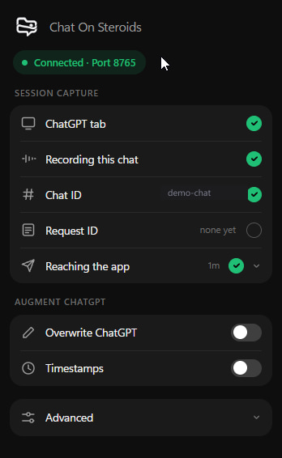
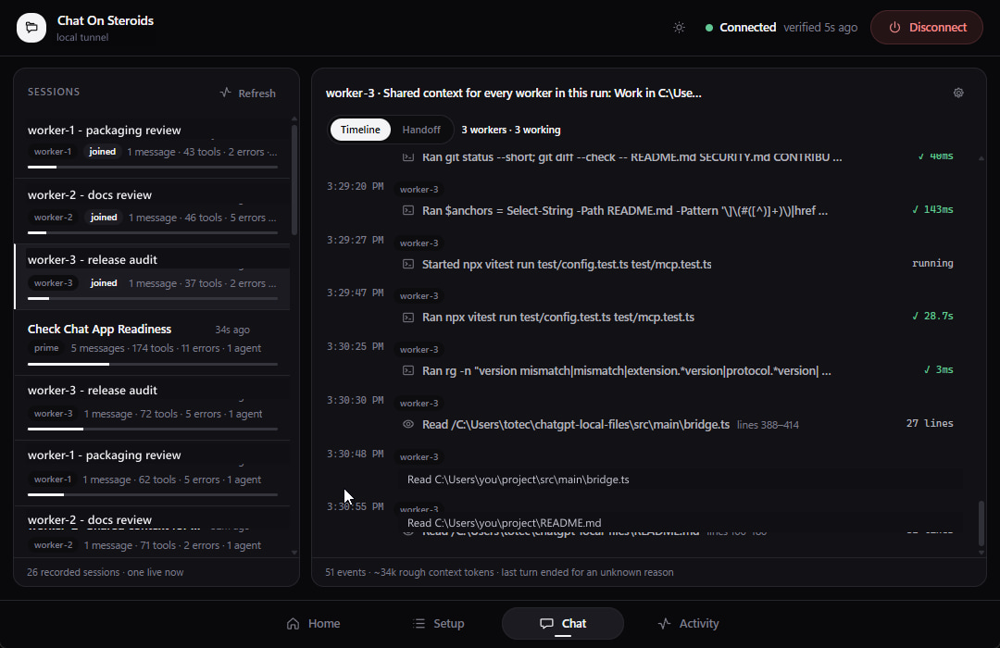

<div align="center">
  
  <h1>Chat On Steroids</h1>
  <p><strong>Give ChatGPT a controlled bridge to your Windows PC.</strong></p>
  <p>Local files, commands, desktop control, durable session history, Compact &amp; Resume, and experimental worker chats over MCP.</p>
  <p>
    <a href="../../releases/latest"><strong>Download</strong></a>
    · <a href="#three-minute-setup">Setup</a>
    · <a href="#permissions-and-security-boundaries">Security</a>
    · <a href="CHANGELOG.md">Changelog</a>
  </p>
</div>

<p align="center">
  
  
</p>
<p align="center">
  
</p>

Chat On Steroids is a Windows desktop app that exposes only the folders and capabilities you configure through a local MCP server. You keep using ChatGPT in the browser. The app is the permission boundary and local executor; the companion Chrome extension adds browser-side chat attribution, session capture, richer tool rows, Compact & Resume, and experimental multi-agent coordination.

## Download

| Windows | Installer |
| --- | --- |
| **10 / 11 x64** (Intel or AMD 64-bit) | [Download x64](../../releases/latest/download/Chat-On-Steroids-Setup-x64.exe) |
| **11 ARM64** | [Download ARM64](../../releases/latest/download/Chat-On-Steroids-Setup-arm64.exe) |

These are separate architecture-specific installers, not one universal Windows binary. The ARM64 package installs an ARM64 Electron app and native runtime payloads. The assisted installer defaults to a current-user install, which does not require administrator rights; choosing an all-users install may require elevation. It **already contains the matching Chrome extension**. After installation, open the app setup and press **Open extension folder**, then use Chrome's **Load unpacked** once. There is no second download to hunt for. A standalone [extension zip](../../releases/latest/download/Chat-On-Steroids-Extension.zip) is also attached to each release for manual installs; extract it first, then load the extracted folder unpacked.

Every release includes [`SHA256SUMS.txt`](../../releases/latest/download/SHA256SUMS.txt). Verify an installer before running it, then compare the printed hash with the matching line in that file:

```powershell
Get-FileHash .\Chat-On-Steroids-Setup-x64.exe -Algorithm SHA256
```

### Beta, with real permissions

> **Fresh installs currently start with all Chat On Steroids capabilities enabled and read-only mode off.** Review the Home permission panel before connecting ChatGPT. In particular, **Run commands** can execute arbitrary programs as your Windows user, and **Control mouse and keyboard** can interact with applications outside your approved folders.
>
> Use a project folder, not your whole profile or `C:\`. Work on code that is committed or backed up. Path containment is defence in depth, not a kernel sandbox. The installer is unsigned, so SmartScreen will warn. See [Permissions and security boundaries](#permissions-and-security-boundaries) and [`SECURITY.md`](SECURITY.md).

## What it adds

| Area | What ChatGPT gets |
| --- | --- |
| Files | Bounded read/search plus preflighted multi-file text patches inside approved roots |
| Commands | PowerShell/cmd processes and interactive terminal sessions, when enabled |
| Desktop | Screenshots, window/control inspection, mouse, keyboard and clipboard permissions |
| Sessions | Local durable history, real tool-call evidence and Compact & Resume |
| Workers | Experimental prime/worker chats with deterministic local routing |

The app has no replacement chat UI and does not host a model. It runs quietly in the tray and bridges ChatGPT to capabilities on the PC you already use.

## Requirements

- **Windows 10 or 11 x64**, or **Windows 11 ARM64** for the native ARM build.
- **Chrome 116+** if you want session attribution, Compact & Resume, Overwrite, or worker chats.
- A ChatGPT workspace where **Developer mode** and custom MCP apps are available on the web. OpenAI currently documents full MCP support, including write/modify actions, as a **beta rollout for Business, Enterprise and Edu**; **Pro** can connect custom MCPs for read/fetch only. Business developer mode is admin/owner controlled, while Enterprise/Edu can additionally use workspace permissions/RBAC. Availability, policy and UI can change, so check OpenAI's current [Developer mode and MCP apps](https://help.openai.com/en/articles/12584461-developer-mode-and-mcp-apps-in-chatgpt) documentation if your workspace differs.

Use a normal ChatGPT conversation with the custom app enabled. OpenAI's built-in **Agent mode** currently does not use custom apps; Chat On Steroids' experimental worker chats are a separate browser-augmentation feature.

The recommended connection uses OpenAI's Secure MCP Tunnel. Release builds bundle a pinned, checksum-verified [`tunnel-client`](https://github.com/openai/tunnel-client/releases) for the installer's CPU architecture. An explicit binary you choose, a copy on `PATH`, or a normal install location can still override the bundled one. Cloudflare and self-hosted HTTPS tunnels remain available as alternatives.

## Three-minute setup

1. Install the build for your CPU and open Chat On Steroids.
2. **Review permissions**, then approve one or more project folders.
3. Create an OpenAI Secure MCP Tunnel and a restricted API key with **Tunnels: Read** and **Use**.
4. In ChatGPT on the web, enable Developer mode and create the Core app. Create the Desktop app too if you enabled screen/control/clipboard permissions. Your workspace admin may need to grant or enable Developer mode first.
5. In Chat On Steroids, press **Open extension folder**. In `chrome://extensions`, enable Developer mode, choose **Load unpacked**, and select that folder. Pairing is automatic.

The Setup tab tracks each hop and only marks it complete once that side of the chain has actually been observed.

### OpenAI Secure MCP Tunnel

1. In [Platform → Tunnels](https://platform.openai.com/settings/organization/tunnels), create a tunnel in the **same workspace you use in ChatGPT** and copy its ID (`tunnel_…`).
2. In [Platform → API keys](https://platform.openai.com/settings/organization/api-keys), create a **Restricted** key with only **Tunnels: Read** and **Tunnels: Use**.
3. Paste both into the Setup tab and press **Connect**.
4. In ChatGPT on the web, enable Developer mode from **Settings → Apps → Advanced settings**, or from the workspace Apps area. Business workspaces require an admin/owner; Enterprise/Edu may also require RBAC access from an admin.
5. Create a custom app, choose **Tunnel**, select the tunnel, review the discovered actions, and publish/enable it as your workspace requires.

For OpenAI tunnels, Core and the optional Desktop surface use separate tunnel IDs because ChatGPT addresses each custom app as one endpoint.

### Cloudflare quick tunnel

Press **Connect**, copy the URL the app shows, and use it as the MCP server URL when creating the custom app in ChatGPT. The URL is public and its random path is the capability secret, so treat the complete URL like a password. It changes when the app restarts.

### Run your own tunnel

Point your own HTTPS tunnel at the loopback URL shown by the app and give ChatGPT the public equivalent, including the secret path.

After changing permissions or tool shape, refresh/review the custom app in ChatGPT, or recreate it if your workspace does not expose a refresh action, then start a new conversation. ChatGPT can retain the previously reviewed action set, so the desktop app does not pretend it can hot-rewrite an already cached schema.

### Experimental browser augmentation and OpenAI terms

The MCP connector uses ChatGPT's documented Developer mode and Secure MCP Tunnel path. The **companion extension is different**: it observes ChatGPT's web UI, records browser-rendered conversation state locally, and the experimental worker feature opens and seeds additional ChatGPT tabs. Those browser-augmentation paths are experimental and are **not a documented public ChatGPT automation API**. Depending on the account and workflow, OpenAI terms and policies around automated extraction, rate limits, access controls, safeguards and permitted use may apply. **Review the agreement that governs your account before using the extension or multi-agent mode.** Do not use these features to scrape or bulk-extract ChatGPT data, evade limits or confirmations, or bypass access and safety controls. See OpenAI's [Terms and policies](https://openai.com/policies/), [Services Agreement](https://openai.com/policies/services-agreement/) and current [Developer mode documentation](https://help.openai.com/en/articles/12584461-developer-mode-and-mcp-apps-in-chatgpt).

### Windows SmartScreen

The installers are not code-signed, so browsers and Windows may warn that the download is uncommon or unverified. In SmartScreen, choose **More info → Run anyway** only after verifying the SHA-256 against the release checksum. If you do not want to run an unsigned binary, [build from source](#building) instead.

## Permissions and security boundaries

Fresh installs intentionally start **fully enabled**: file/search/write permissions, command execution, screen/control/clipboard access, session recording and experimental multi-agent mode are on; read-only mode is off. Existing installs keep their stored choices. Review the permission panel before connecting ChatGPT.

The important boundaries are simple:

- **File tools are limited to approved folders.** Paths are validated and canonicalised before access. This is application-level containment, not an OS or VM sandbox; same-user filesystem races remain possible.
- **Commands are not folder-sandboxed.** `exec_command` starts in an approved folder but then runs with your normal Windows user privileges and can reach anything that user can reach.
- **Desktop control is not folder-scoped.** Screen capture, mouse/keyboard input and clipboard access apply to the desktop when their permissions are enabled.
- **The MCP server is loopback-only.** A random secret path protects each local connector. ChatGPT reaches it through the tunnel you configure; treat any complete public tunnel URL as a secret.
- **Secrets are encrypted at rest** with Electron `safeStorage` / Windows DPAPI and are kept out of the renderer and normal logs.
- **The browser bridge is separate and loopback-only.** It exists for the companion extension and does not expose file, command or settings routes.

Read-only mode is the fast kill switch for local mutation: it disables file writes, command execution, desktop control and clipboard writes while leaving read-only capabilities available. See [`SECURITY.md`](SECURITY.md) for reporting and scope.

## Connectors and tools

Chat On Steroids publishes two MCP apps:

| Connector | Purpose | Current tool names |
| --- | --- | --- |
| **Core** | Approved files, search, patches, terminal, bounded host operations, session lookup, workers | `read`, `view_image`, `find`, `apply_patch`, `exec_command`, `write_stdin`, `power`, `session`, `agents` |
| **Desktop** | Screen, windows, mouse/keyboard and clipboard | `observe`, `computer` |

Core declares nine possible names but exposes at most eight at once because `find` is the no-shell search fallback and is mutually exclusive with the command tools. `power` stays one composite schema for bounded system information, process listing and process-tree termination; all three actions use the existing command permission and re-check it on every call. Desktop is optional. Revoking a permission takes effect immediately even if ChatGPT still shows a schema cached earlier; refresh the app in ChatGPT and start a new chat when you change the exposed tool shape.

The public tool contract and permission mapping live in [`docs/tool-surface.md`](docs/tool-surface.md).

## Session recording and the extension

Session recording is **on by default for new installs** and can be disabled. It stores the local history needed for the Chat timeline and `session` lookup under `%APPDATA%\chat-on-steroids\sessions\`. The small Activity log is separate, capped, redacted and memory-only. Session retention defaults to 30 days.

The bundled Chrome extension adds browser-side conversation identity, page-visible transcript capture, richer tool rows, Compact & Resume, and worker-tab coordination. Its popup also has an Operations rail for live conversation/command counts and the three durable browser queues; **Sync now** flushes ACKs, observations and close notices in order before refreshing eligible ChatGPT tabs. It runs only on `chatgpt.com` / `chat.openai.com` plus the app's loopback bridge ports. App and extension versions move together, so after updating the app, use **Reload** for the unpacked extension in `chrome://extensions`.

### Compact & Resume

For long recorded sessions, the app estimates context pressure locally. Fresh installs warn around **300k estimated tokens**, use **400k** as the observed limit marker, and enable automatic compaction at 300k. These are local estimates, not ChatGPT's private context counter.

Compact & Resume asks the current chat to write a handoff, stores it locally, opens a fresh ChatGPT conversation and rebinds the **same local session** to it. The original session remains intact if the handoff cannot be completed.

### Multi-agent goals (experimental)

Fresh installs currently enable multi-agent mode with **two workers** by default; the hard maximum is eight. One prime chat can open worker chats and exchange brokered messages with them. Workers cannot message each other directly.

The same single `agents` tool now keeps durable goals with explicit task acceptance criteria. A goal task can run in a separate ChatGPT conversation or through a locally installed **Claude Code** or **Hermes Agent** CLI. External agent processes are owned and cancellable, run only inside an approved folder, require the app's command permission, and are stopped when the app quits. Chat On Steroids never stores their API keys or login tokens; authenticate each CLI using its own official setup flow.

Open **Chat → Goals** in the desktop app for Mission Control. It can create goals, add acceptance-tested tasks, choose an approved virtual folder, start a local Claude Code or Hermes task, inspect bounded results, and cancel a running child even if command permission was revoked after launch. Native folder paths, environment values, provider credentials and raw command lines never enter the renderer. Goals survive app restarts; a provider task interrupted by restart is marked failed explicitly instead of being silently resumed.

This is experimental browser automation, and parallel chats can edit the same files or spend account limits quickly. Use it only on work you can recover, keep worker ownership explicit, and turn the feature off when you do not want ChatGPT tabs opened or coordinated automatically. The terms note in [Experimental browser augmentation and OpenAI terms](#experimental-browser-augmentation-and-openai-terms) applies here.

## Troubleshooting

- **Tools missing or still visible after a permission change:** refresh/review the custom app in ChatGPT, or recreate it if needed, then start a new conversation so it discovers the current schema.
- **Extension says app not found:** session recording or multi-agent mode must be on for the browser bridge to run; then reopen the extension popup.
- **Extension version mismatch:** reload the unpacked extension after every app update.
- **SmartScreen warning:** expected for the unsigned beta. Verify `SHA256SUMS.txt` before choosing **More info → Run anyway**.
- **Tunnel unavailable:** use the app's Advanced settings to point at an explicit `tunnel-client.exe` / `cloudflared.exe`, or use the bundled tunnel client from the release build.

## Contributing

Bug reports, feature requests and PRs are welcome. Please read [`CONTRIBUTING.md`](CONTRIBUTING.md) first. Security issues go through [`SECURITY.md`](SECURITY.md), privately rather than in an issue or PR. Release history is in [`CHANGELOG.md`](CHANGELOG.md).

## Development

```sh
npm ci
npm run dev        # run the app with hot reload
npm run verify     # typecheck + tests
```

## Building

```sh
npm run dist:x64      # x64 Windows installer
npm run dist:arm64    # ARM64 Windows installer; native runtime smoke runs in CI
```

Release packaging pins and verifies the bundled tunnel/ripgrep assets, stages native dependencies for the target CPU, and produces per-architecture NSIS installers. Release CI builds and smoke-tests x64 and ARM64 on their native Windows runners, then assembles the standalone extension zip and `SHA256SUMS.txt` for publication.

## Licence

MIT — see [`LICENSE`](LICENSE).

Not affiliated with, endorsed by, or connected to OpenAI. "ChatGPT" is a trademark of
OpenAI; it is used here only to describe what this tool interoperates with.
